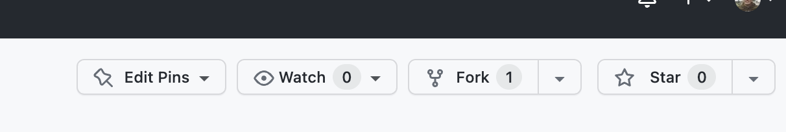
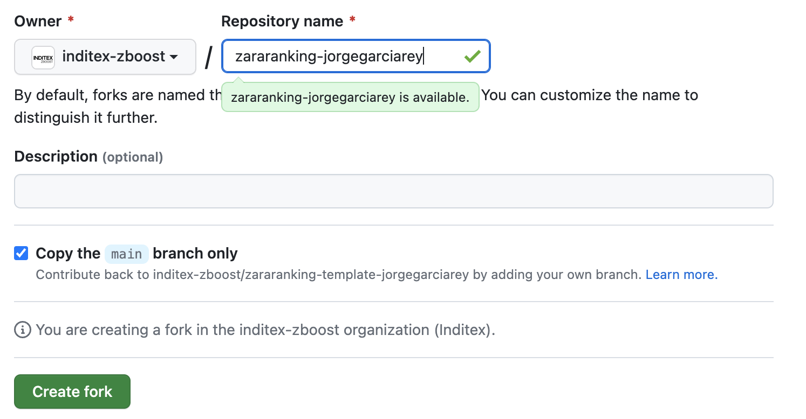
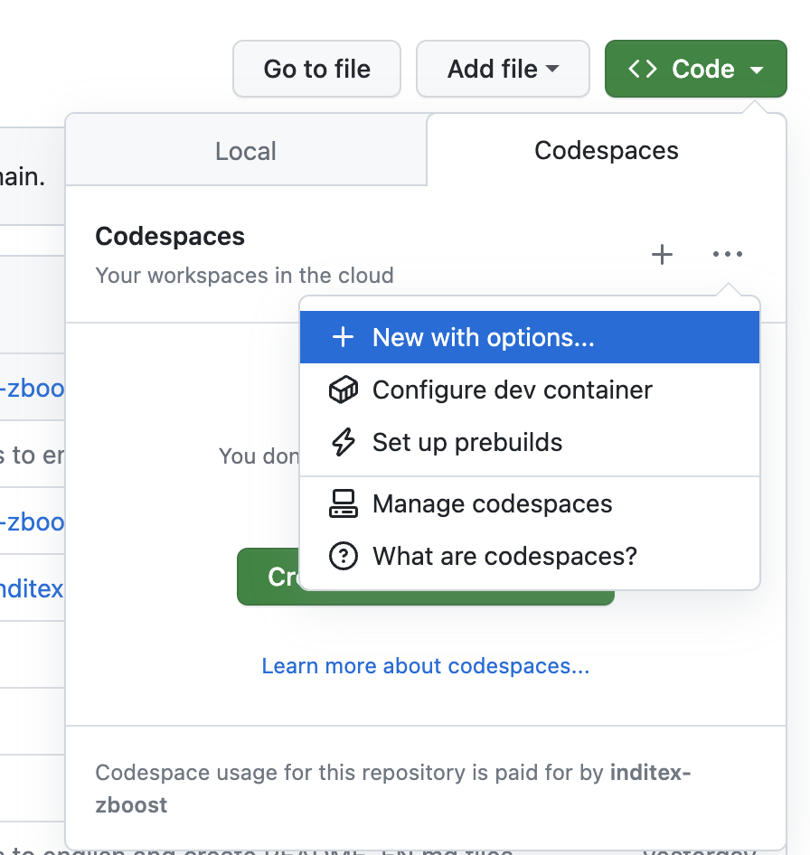
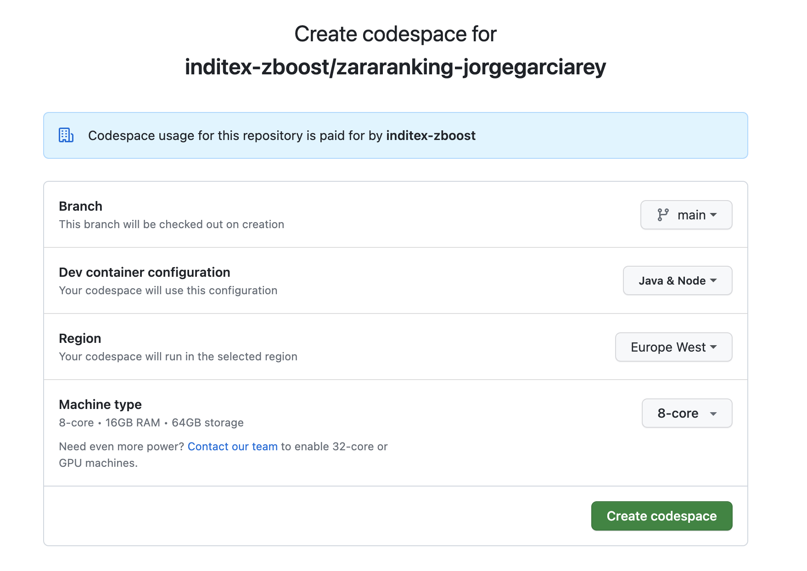
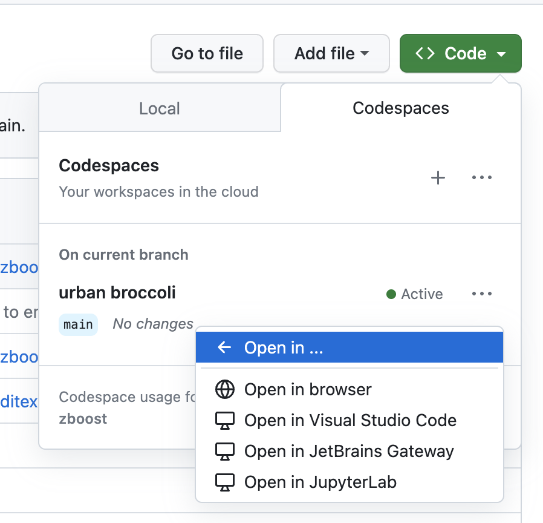

# Inditex ZARA Boost workshop

In this workshop, you will have the opportunity to work with a database containing information about products and orders.

---

## Choose an activity

**_It will be highly valued if the participant wishes to do both activities._**

### 1. [Activity oriented to backend development](actividad-backend/zboost/README.md)

In this activity the user must **create an API Rest** using **Java**, which connects to a database and allows to obtain a ranking of the most sold products between two given dates.

Inside the folder **actividad-backend/zboost** you will find the file `README.md` with the necessary information to work with the project, from the installation, the execution of the application and the basic configuration, you will also find the **exercises** to develop in this test.

### 2. [Frontend development-oriented activity](actividad-frontend/README.md)

The objective of this exercise is to develop a web application using **ReactJS** that allows users to see a ranking of clothes and filter them by type and date.

Inside the `actividad-frontend` folder you will find the `README.md` file with all the necessary information to work with the project, from the installation of the local environment, its execution and you will also find the **exercises** to develop in this test.

---

## How to develop the activity

### 1. Create a GitHub account

If you don't have a GitHub account, you must [create one!](https://github.com/join)

### 2. Create a fork

Create a copy of this repository using **Fork** from GitHub. You can access it directly from this web interface at the top right.

The **fork must name** `zararanking-<github_account_name>`, for example `zararanking-jorgegarciarey`.





### 3. Create a GitHub Codespace

**We are setup [GitHub Codespaces](https://github.com/features/codespaces) for you, so you don't need to install anything**.

The remote environment is based on a Docker image that contains the next tools:

- Git 2.40.0
- Java 17.0.6
- Maven 3.9.1
- Node 18.15.0
- NPM 9.5.0

Once the fork is created you will have a copy of the repository. **Create a GitHub Codespace to start working on it**.

You can create a GitHub Codespace from the web interface: `Code` -> `Codespaces` --> `New with options`.



### 4. Configure the GitHub Codespace

You must configure the Codespace with the next options:

- Branch: `main`.
- Dev container configuration: `Java & Node`.
- Region: `Europe West`.
- Machine type: `8 cores - 16GB RAM`.



### 5. Start working on the activity

Once the Codespace is created, you can open the repository in a browser or IDE.

To open the repository, you must click on the  `Code` -> `Codespaces` --> `Open in ...`.



### 6. Add the changes to your branch

When you finish the activity, you must upload the changes to your fork.

```sh
git add .
git commit -m "actividad zboost"
git push origin main
```

❗❗❗ **REMEMBER: Do not upload your changes until the time is up.**
