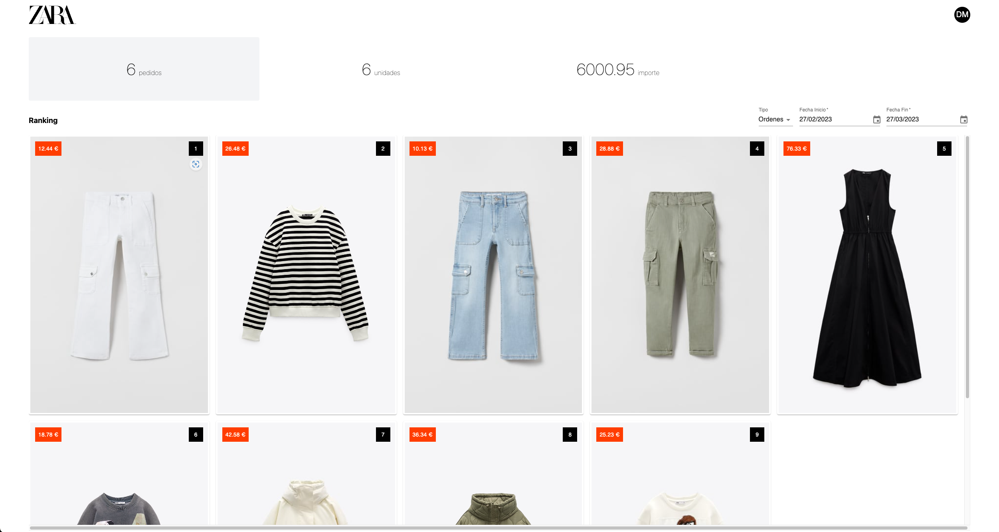

# Requirements

The only requirement for this project is to create a GitHub Codespace. See [Create a GitHub Codespace](../README.md#3-create-a-github-codespace).

# Description of the activity

This project aims to create a visually appealing web application for users, which allows them to view a ranking of garments, and filter by type and date, for the development we have used the following technologies:

- [ReactJS](https://reactjs.org/) - Web Framework to build the interface.
- [Msw](https://mswjs.io/) - Library that helps us to mockear APIs
- [Vite](https://vitejs.dev/) - Tool to build the project
- HTML - CSS - JavaScript - Fundamental technologies for the creation of the web application.

# 🚀 How do I run it?

To run the application locally, follow the steps below:

1. Open a terminal and move to the folder of the project.

```shell
cd actividad-frontend
```

2. Install the dependencies:

```shell
npm install
```

3. Now, run the following command to start the application:

```shell
npm start
```

You can also validate the tests using:

```shell
npm run test
```

# 📦 Web components library
You can use any component library that is based on ReactJS. Some recommendations are mentioned below:

- [Material UI](https://mui.com/)
- [Antd](https://ant.design/)
- [Chakra UI](https://chakra-ui.com/)

Or you can also create your own components 😎 (not recommended due to time restrictions).

# 🗽 Design:



# 💪 Exercises

>💡 Before starting with the exercises select a component library.

### 📝 Note

Some exercises will have within the code, to guide you:

```js
// TODO: Exercise X --------------
```

### :dart: Objectives

The objective for the following exercises are:

* Implement the various components with the required behavior and have them display correctly in the UI.

* Achieve a code coverage greater than `60%` with the tests you implement. You can use the tests included in the application as a reference. You can see the current coverage by running `npm run coverage`.
To prove that you have met the objectives, when you finish the exercise you can leave a screenshot with your results in the folder of your choice (for example a`actividad-frontend/results/`).


## Exercise 1:

We will add a component to indicate our avatar in the application inside the Header component.

## Exercise 2:

Create the Summary component, in this we will show three cards with the order, units and price quantities.
Then we will change the `<Summary />` component by the `<Placeholder>` in the `app.jsx` file (You have TODO 😉).

>💡 I recommend you to create a  `/summary` folder inside the `/components` folder to create the component and use it inside the App component (app.jsx).

Bind the quantities to our API data, using the following endpoint:

```
/report-summary
```

💡 I recommend you to use [fetch](https://developer.mozilla.org/en-US/docs/Web/API/Fetch_API/Using_Fetch) to be able to query the API.

## Exercise 3:

In this exercise, you will need to create the `Ranking` component, which will have two child components. The first one will be a filter and sort bar, and the second one will be the ranking.

### Exercise 3.1:
Create a ranking of garments with cards where the image of the garment, the price and the position of the ranking will be displayed.

### Exercise 3.2:
Now you will need to link the selector and dates with the following API to return a ranking of garments:

```
/ranking
```


>💡 Use swagger.io to know how to make the ranking request.


### Exercise 3.3:
In the ranking bar, it will show on the left side the title Ranking and on the right side a selector with these options:

```js
const TYPES = [
    { value: "orders", label: "Ordenes" },
    { value: "units", label: "Unidades" },
    { value: "amount", label: "Total" }
];
```

### Exercise 3.4:
In the ranking bar on the right side next to the type selector, two `DatePicker` will be included to indicate the start date and end date to filter the data.


>💡 Note that the API mock is prepared only for types, so you will have to modify the mock to take dates into account and validate that they arrive with this format `YYYY/MM/DD`.

## Extra Exercise:

Perform an integration test that checks that changing the type selector and dates correctly displays the ranking.

>💡 You have a test in `components/header`

>💡 To check the tests use this command `npm run test`

# 🤔 Where are the mocks?

In the file `mocks/handlers.js`, you will have all the mocks of each api that you can check:

- `/products`
- `/products/categories`
- `/report-summary`
- `/orders/:orderId`
- `/orders`
- `/ranking`

# 🥺 Error msw Worker

If the development server has an error with the MSW, you may not be able to start the project. To fix this problem, use the following command in the terminal:

```shell
npm run init:worker:msw
```
